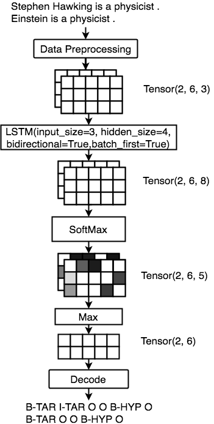

# Hyponymy-Classification-Model-using-BiLSTM

# Objective
In this project, you need to build a system that can extract hyponym and hypernym from a sentence.

For example, in sentence Stephen Hawking is a physicist ., phrase Stephen Hawking is the hyponym of physicist, and physicist is the hypernym of Stephen Hawking.

We formulate the problem as a sequence tagging task where Input is a sentence formed as a sequence of words with length  l.

output is a tag sequence with length  l.

We use IOB2) scheme to represent the results (i.e., encode the tags), as both hypernyms and hyponyms can be phrases.

Thus, in the above example,
[Stephen, Hawking, is, a, physicist, .] is the input word list

[B-TAR, I-TAR, O, O, B-HYP, O] is the corresponding output tag sequence, 

where TAR corresponds to hyponyms and HYP corresponds to hypernyms.

The entire implementaion to achieve the functionality can be found in the file todo.py

# evaluate()
Here we are required to implement the evaluate() method in todo.py. This method computes the F1 score of the given predicted tags and golden tags (i.e., ground truth).

The input arguments of evaluate() are:

golden_list is a list of list of tags, which stores the golden tags.
predict_list is a list of list of tags, which stores the predicted tags.

The method should return the F1 score based on golden_list and predict_list. In this project, we only consider the phrase level matching for TAR and HYP (O is not considered). Two entities are matched when both the boundaries and the tags are the same.

For example, given

golden_list = [['B-TAR', 'I-TAR', 'O', 'B-HYP'], ['B-TAR', 'O', 'O', 'B-HYP']]
predict_list = [['B-TAR', 'O', 'O', 'O'], ['B-TAR', 'O', 'B-HYP', 'I-HYP']]

The first TAR in golden_list does not match with predict_list, as the boundary is not incorrect (e.g., predict_list[0][1] is O, which should be I-TAR for a correct matching).
The second TAR in golden_list matches with the second TAR in predict_list, as both the boundary and the tag are the same.
The number of false positives in the above example is 2, the number of false negative in the above example is 3, and the number of true positive is 1. Therefore, the F1 should be 0.286.

NOTE:
The length of the two lists are the same, and length of the  i-th instance in both lists are the same as well. Which means that you do not need to handle the alignment issue.

## Workflow

